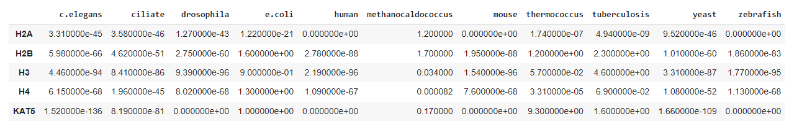
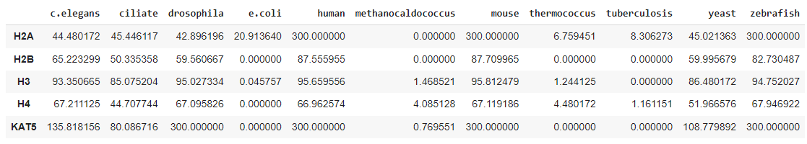
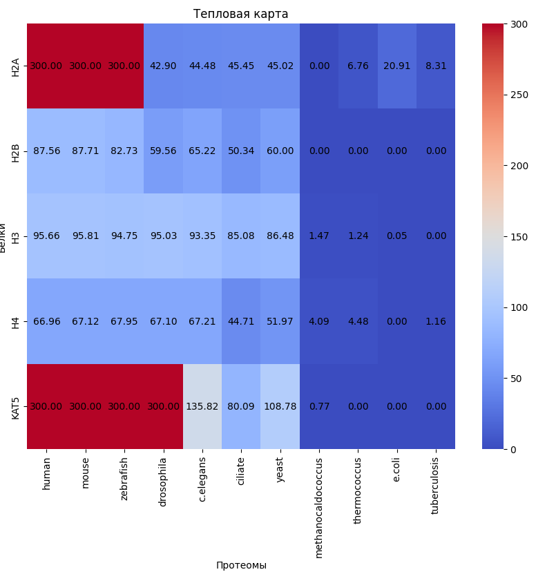

# HSE23 Bioinf Final Project

Фермент KAT5 ацетилирует гистоны в нуклеосоме

В статье утверждается, что ослабление KAT5 подавляет обогащение H3K27ac, что в свою очередь уменьшает жизнеспособность клеток рака молочной железы [1]

Больше всего экспрессирует в матке, большеберцовой артерии и фаллопиевых трубах

В структуре имеет домены PHD, CHROMO, RING, ING, Tudor

[1] Huixin Li, Wei Liu, Xiaoyu Zhang, Feng Wu, Dan Sun, Zunyi Wang Ketamine suppresses proliferation and induces ferroptosis and apoptosis of breast cancer cells by targeting KAT5/GPX4 axis PMID: 34800882 DOI: 10.1016/j.bbrc.2021.11.029

Таблица с E-value:

Таблица с -log(E-value):

Тепловая карта по второй таблице:

Множественное выравнивание гистонов находится в файлах c суффиксом &#95;a в папке histones. Файлы без суффикса - это выбранные варианты.

Для H2A в выравнивании видны две группы, в одной из которых последовательности заметно длине. Вероятно, меньшая по длинне группа произошла из более длинной путем вырезания, так что был взят вариант из более длинной.

Для H2B в выравнивании практически все последовательности довольно схожи, кроме нескольких с подпоследовательностями в начале. Был взят вариант из более частой последовательности.

Для двух оставшихся в выравнивании не видно особых различий, были взяты наиболее похожие на все остальные.

По тепловой карте можно определить, что раньше всего белок появился ровно в таком виде у многоклеточных беспозвоночных.